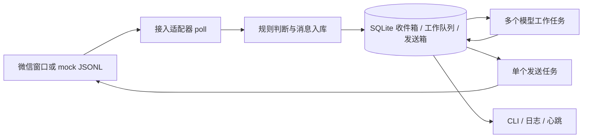
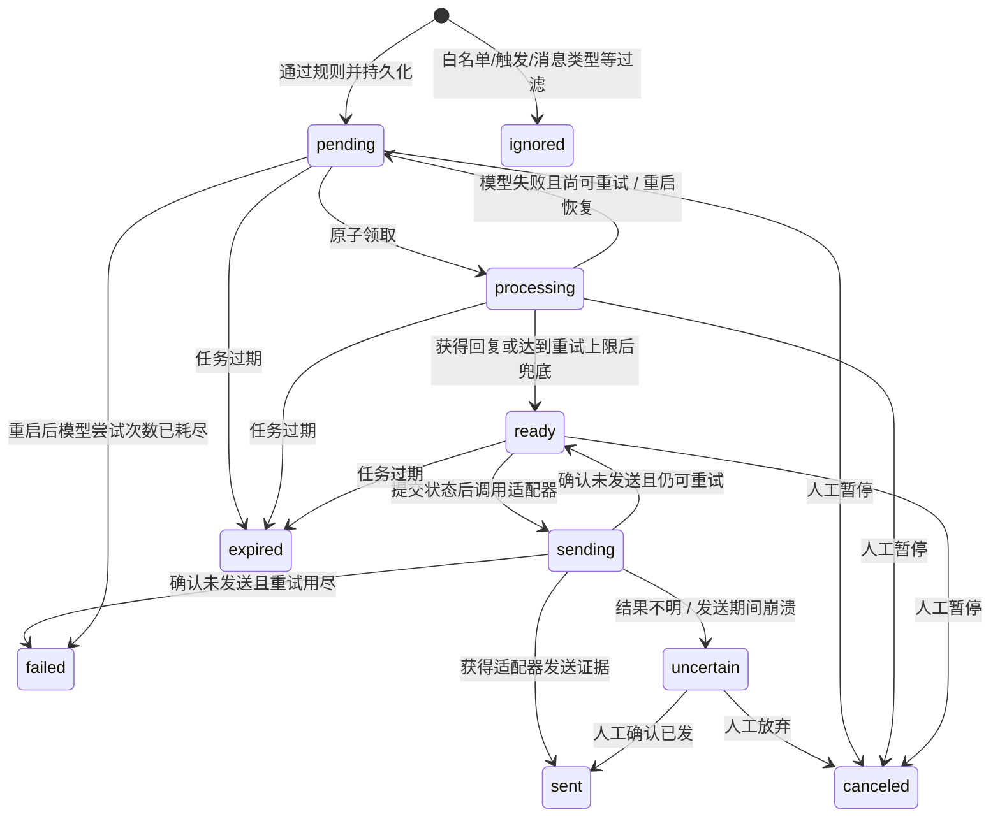

# 架构设计

## 依赖方向

`cli → engine → domain/policy + storage + adapter/model 契约`。
接入适配器将外部消息转换为 `Message`；模型实现只接收提示词和历史。
`policy.py` 不访问网络、数据库或桌面；`domain.py` 不依赖外部框架。
第一版使用具体的 `Store`，暂不增加没有实际需求的仓储接口或微服务。

## 消息生命周期

`ignored/expired/canceled/failed` 均不会自动重新执行。
`uncertain` 不受 TTL 自动清除，阻塞本会话后续工作直到人工处置。
这里的 `sent` 只代表适配器确认了发送证据：mock 为本地输出，UIA 为新出现的己方消息行。
它不等于微信服务端已交付，更不等于对方已读。

## 一致性策略

1. `poll → 入库 → ack`：未提交的数据不会被确认为已消费。
2. `UNIQUE(source,message_id)`：平台/适配器重放不会创建重复任务；相同正文的新消息仍可处理。
3. 同一 `source + conversation_id` 的早期活跃任务阻塞后续任务。顺序是入库顺序，
   不是对乱序到达消息的服务端时间排序。接入层应尽量按真实接收顺序返回。
4. 调用模型不在 SQL 事务里，避免慢请求持有数据库写锁。
5. 回复文本先持久化为 `ready`，再提交 `sending`，最后调用外部发送。
6. 数据库与微信之间没有分布式事务，不能保证 exactly-once。结果不明时停止自动重发。
7. SQLite WAL + FULL 同步配合短事务；只支持本地磁盘上的单运行实例。
   不要把 SQLite 放网络共享盘，不要多实例使用不同数据库控制同一个微信账号。

## 并发和背压

- `workers` 限制正在生成的模型任务；SQL 队列持久化等待任务。
- 同群不同提问者上下文隔离，但发送顺序仍按整个群串行。
- `send_interval_seconds` 控制全局发送尝试间隔，并将上次尝试时间持久化。
- 入站失败采用有限上限的指数退避；持续失败时停止领取新生成/发送任务并更新心跳。
- Windows 所有 UIA 操作由一个专用线程执行，避免 COM 对象跨线程及窗口操作竞争。
- TTL 过期任务不发送；数据库磁盘容量尚无硬限额，见 T08。

## 暂停与恢复

数据库暂停可为全局 `*` 或单会话；取消排队/生成/待发送任务，新消息记为 ignored。
文件 `PAUSE` 可作为紧急开关，在调度时取消排队任务；移除后不会恢复旧任务。
生成完成使用带旧状态的 UPDATE，无法把已取消任务重新变成 ready。
发送已经开始后无法撤销，这是外部操作的真实边界。

## 上下文与隐私

会话键采用 JSON 元组编码，避免简单字符串拼接碰撞。
私聊键含来源、聊天类型、会话 ID；群聊再加发送者 ID。
只读取 `sent` 任务的最近 `context_turns` 轮，不纳入其他会话或未确认发送内容。
日志默认只含状态、任务号和错误类型；数据库和 mock JSONL 含明文正文。
TODO(T08)：归档/清理时应保留足够的去重记录，否则旧入站重放可能再次被处理。

